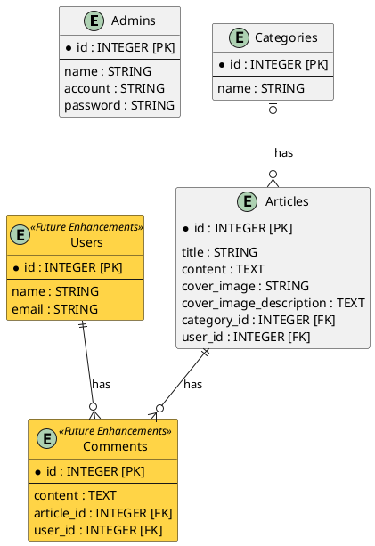

```plantuml
@startuml

skinparam  class {
    BackgroundColor<<Future Enhancements>> #FFD446
}

entity "Admins" {
  *id : INTEGER [PK]
  --
  name : STRING
  account : STRING
  password : STRING
}

entity "Articles" {
  *id : INTEGER [PK]
  --
  title : STRING
  content : TEXT
  cover_image : STRING
  cover_image_description : TEXT
  category_id : INTEGER [FK]
  user_id : INTEGER [FK]
}

entity "Categories" {
  *id : INTEGER [PK]
  --
  name : STRING
}

entity "Comments" <<Future Enhancements>> {
  *id : INTEGER [PK]
  --
  content : TEXT
  article_id : INTEGER [FK]
  user_id : INTEGER [FK]
}


entity "Users" <<Future Enhancements>> {
  *id : INTEGER [PK]
  --
  name : STRING
  email : STRING
}

Users ||--o{ Comments : "has"
Articles ||--o{ Comments : "has"
Categories |o--o{ Articles : "has"

@enduml
```
