# Admin Sequence Diagram

## 1. Browsing

- Admin can browse articles without logging in.

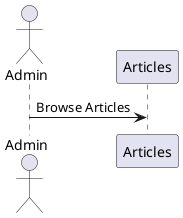

## 2. Sign In

- Admin can sign in:
  - If sign-in fails:
    - Return to the sign-in step.
  - If sign-in succeeds:
    - Redirect to /blog.

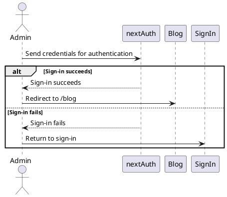

## 3. Managing Articles

- In /admin/articles:
  - Create Article: axios.post('/api/articles')
    - If creation fails:
      - Stay on this step and return an error.
    - If creation succeeds:
      - Redirect to /blog and retrieve new data.

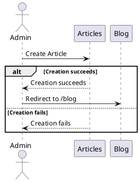

- Update Article: axios.put('/api/articles/:id')
  - If update fails:
    - Stay on this step and return an error.
  - If update succeeds:
    - Redirect to /blog/:id and retrieve new data.

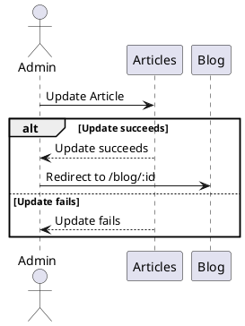

- Delete Article: axios.delete('/api/articles/:id')
  - If delete fails:
    - Stay on this step and return an error.
  - If delete succeeds:
    - Redirect to /blog and retrieve new data.

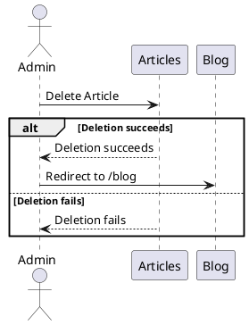

## 3.1 Uploading Images

- In /admin/articles:
  - Upload Image: axios.post('/api/articles/image', formData)
    - If upload fails:
      - Return an error message.
    - If upload succeeds:
      - Retrieve the public S3 URL.
      - Use TinyURL API to shorten the URL.
      - Display the shortened URL.

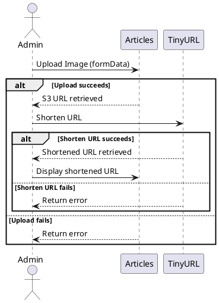

## 4. Managing Categories

- In /admin/categories:
  - Create Category: axios.post('/api/categories')
    - If creation fails:
      - Stay on this step and return an error.
    - If creation succeeds:
      - Retrieve new data.

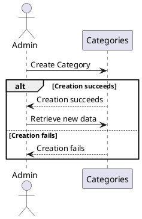

- Update Category: axios.put('/api/categories/:id')
  - If update fails:
    - Stay on this step and return an error.
  - If update succeeds:
    - Retrieve new data.

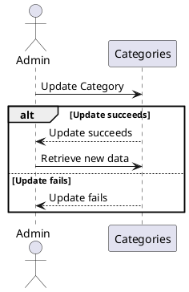

- Delete Category: axios.delete('/api/categories/:id')
  - If delete fails:
    - Stay on this step and return an error.
  - If delete succeeds:
    - Retrieve new data.

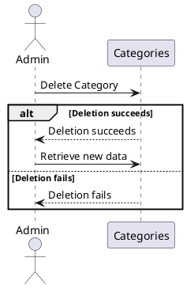

## 5. Future Enhancements

### 5.1 Draft Feature for Article Creation

- Add a draft feature to the Create Article functionality:
  - Allow articles to be saved as drafts.
  - Drafts will not be published to the blog.
  - Admin can later edit and publish drafts.
  - API endpoint: `axios.post('/api/articles/draft')`
  - Draft-specific error handling:
    - If draft creation fails:
      - Stay on this step and return an error.
    - If draft creation succeeds:
      - Save the draft and allow further editing.

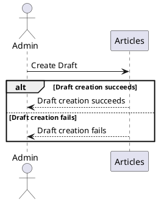

### 5.2 Comments Feature and User Management

- Add a comments feature to articles:
  - Introduce a `Users` model with the following fields:
    - `id` (primary key)
    - `name`
    - `email`
  - Introduce a `Comments` model with the following fields:
    - `id` (primary key)
    - `content`
    - `post_id` (foreign key to `Articles`)
    - `user_id` (foreign key to `Users`)
  - Users will be added to the database upon their first login using third-party authentication.
  - No password field is required for the `Users` model since local registration is not used.
  - When a user leaves a comment:
    - The admin will receive an email notification.
  - When the admin replies to a comment:
    - An email notification will be sent to the user who left the comment.

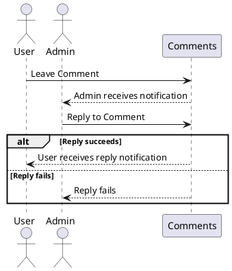
